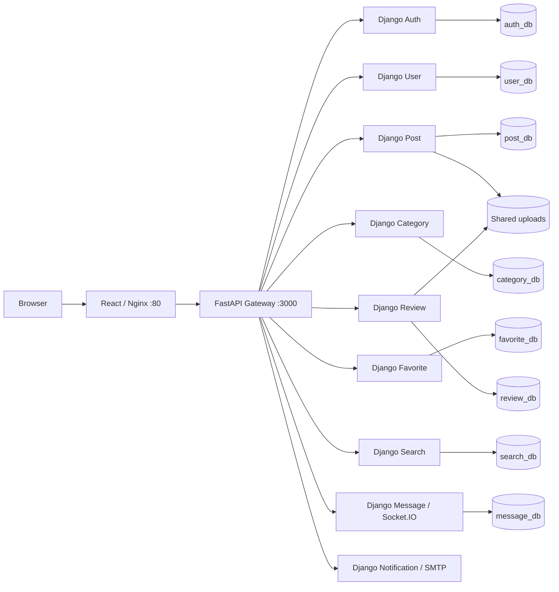

# Used Goods Marketplace — Python Microservices

A marketplace for second-hand goods, with moderated listings, image uploads, search, favorites, seller reviews, and real-time conversations. The React client uses a FastAPI gateway; nine Django services own the business logic. The backend was migrated from Node.js while preserving existing HTTP contracts, MySQL schemas, records, and upload files.

This is a locally verified development/portfolio project. CI and image publishing are configured; production deployment has not been performed. See the [Phase 8 verification report](docs/migration/phase-8-report.md) for completed checks and any pending gates.

## Architecture



| Component | Framework | Internal port | Owned database | Responsibility |
|---|---|---:|---|---|
| api-gateway | FastAPI / HTTPX | 3000 | — | HTTP routing and Socket.IO transport proxy |
| auth-service | Django / DRF | 3001 | auth_db | Registration, OTP, login, JWT |
| user-service | Django / DRF | 3002 | user_db | User profiles and Auth ID mapping |
| post-service | Django / DRF | 3003 | post_db | Listings, moderation, image uploads |
| category-service | Django / DRF | 3004 | category_db | Category lookup and administration |
| message-service | Django / python-socketio / ASGI | 3005 | message_db | Conversations, persisted notifications, real-time events |
| notification-service | Django / DRF | 3006 | — | SMTP email delivery and development mock mode |
| review-service | Django / DRF | 3007 | review_db | Seller reviews and review images |
| search-service | Django / DRF | 3008 | search_db | MySQL search projection and synchronization |
| favorite-service | Django / DRF | 3009 | favorite_db | Favorite toggles and listing enrichment |
| frontend | React 18 / Vite / Nginx | 80 | — | Browser application and reverse proxy |

Root Compose runs **19 containers: 10 backend + 8 MySQL + 1 frontend/Nginx**. Notification is database-free. There are nine persistent volumes: eight database volumes and one shared upload volume. Node/npm is frontend tooling; the canonical backend runtime is Python.

## Quick start

Requirements: Git, Docker with Compose v2 and Linux containers, and Python 3.12 for the volume bootstrap helper. Node 18/npm is needed for host frontend development/tests. Allow enough disk space for eleven images and eight MySQL instances; Docker must be running.

```bash
cp .env.example .env
```

Fill the blank fields privately. For a **new installation**, choose random `PYTHON_SECRET_KEY`, `JWT_SECRET`, and `MYSQL_ROOT_PASSWORD`; set `PYTHON_DB_USER=root` and `PYTHON_DB_PASSWORD` to that root password. For an **existing installation**, retain its current keys, database credentials, and volumes. Leave `MOCK_EMAIL=true` for local work unless SMTP has been deliberately configured. Never commit `.env`.

```bash
python tools/bootstrap_volumes.py --create-missing
docker compose config --quiet
docker compose up -d --build
docker compose ps
```

Open [the application](http://localhost/) or [gateway API documentation](http://localhost:3000/docs). The bootstrap helper creates missing canonical volumes only. Fresh volumes initialize from `seeds/schema/` with **schema only**, without historical accounts or personal data. Business tables are initially empty; register a new user and create categories/listings through the supported application/API workflow. No private fixture dump is needed. Existing volumes are not reinitialized by MySQL.

Stop without deleting data:

```bash
docker compose down
```

The named data volumes are external. Do not delete or replace them when upgrading an existing installation. Full setup and troubleshooting: [development guide](docs/development.md).

## Features and contracts

- Register, verify an OTP, log in, and edit a profile using the preserved JWT contract.
- Create image-backed listings; moderation follows **pending → approved / rejected**. Only approved listings appear in public results.
- Browse categories, query search, and save favorites.
- Review sellers and upload review images.
- Exchange persisted messages and receive real-time message/notification events.
- Inspect health, readiness, request-ID logs, and API schemas.

Socket.IO uses `/socket.io/`. Preserved events are `join_user_room`, `receive_message`, and `receive_notification`; messages are written through HTTP. Message runs **one Uvicorn worker** because room membership lives in process memory. Do not increase workers without adding a shared Socket.IO manager and verifying room fan-out. Room joining retains the legacy security limitations documented in [architecture](docs/architecture.md).

## Verification

Create/activate a Python 3.12 virtual environment, then:

```bash
python -m pip install -r requirements-dev.lock.txt
python -m pip check
python tools/verify_foundation.py
npm ci --prefix do-cu-frontend
node do-cu-frontend/tests/frontend-contracts.test.js
npm run build --prefix do-cu-frontend
python tools/verify_ci.py --validate-only
python tools/verify_ci.py --smoke
```

`verify_foundation.py` runs Ruff lint/format, checks all nine Django services, imports the gateway, and runs Python unit/contract tests. `verify_ci.py` builds all eleven images and runs the canonical suite against a disposable 19-container stack. Omit `--smoke` for the full 48-case integration suite. It uses generated credentials, schema-only templates, synthetic records, UUID-owned volumes, and a random loopback HTTP port. It does not mount the canonical databases/uploads or require a developer `.env`.

Historical parity suites under `integration-tests/phase2`–`phase6` are opt-in migration evidence and may require retired Node fixtures. They are not a dependency of canonical CI. The existing local Phase 7 wrapper remains available for explicit validation of an existing stack; use its documented snapshot/cleanup safeguards.

## CI and image release configuration

[CI](.github/workflows/ci.yml) checks pull requests and pushes to `develop`/`main`: Python 3.12 quality, frontend install/contracts/build, and isolated Docker integration. Pull requests run the critical smoke selection; branch/manual/release validation runs the full selection. Dependencies are locked and actions are pinned by commit SHA.

[Docker images](.github/workflows/docker-publish.yml) validates CI before building ten backend images plus frontend for GHCR. Version tags such as `v1.2.3` enable publication; manual dispatch defaults to build-only. Names are `ghcr.io/vjettejv/hethongmuabandocu-<service>`, with version and full commit-SHA tags; stable version releases also receive `latest`. Configuration alone does not establish that a remote workflow or publication has run. See [CI/CD guide](docs/ci-cd.md).

## Migration history

| Phase | Scope |
|---|---|
| 0 | Repository and contract audit |
| 1 | Python/Django foundation and Docker baseline |
| 2 | FastAPI gateway and Django Auth |
| 3 | Django User and Category |
| 4 | Django Post and uploads |
| 5 | Django Favorite, Review, and Search |
| 6 | Django Message, Socket.IO, and Notification |
| 7 | Full integration and controlled Node retirement |
| 8 | CI/CD configuration, final documentation, and reproducible clean startup |

Phase 7 reported **913 passing tests**, including **48 full-system cases**, and two cold starts. Those are historical results, not a claim that this exact total was rerun in Phase 8. Subsequent frontend repairs and moderation normalization are recorded separately. Earlier reports, contract inventories, and parity evidence remain under [migration documentation](docs/migration/).

## Known limitations

- Development Compose is not a production deployment; TLS, centralized secrets, monitoring, scaling, and backup/restore operations need separate deployment work.
- JWT/OTP and room authorization retain compatibility behavior; Socket.IO room identity is not a hardened authentication boundary.
- Category creation and notification writes retain legacy access boundaries; not every administrative alias has uniform authorization.
- Search synchronization is best-effort; existing projection drift is audited and preserved rather than silently rebuilt.
- Message room state supports one worker. There is no Redis/shared Socket.IO manager.
- File retention on listing/review deletion follows existing contracts; shared storage is not an object-storage system.
- SMTP is mocked by default. External mail delivery requires separately supplied credentials and testing.
- Node 18 remains the existing frontend toolchain; upgrading it is outside this migration phase.

## Repository guide

```text
.github/workflows/       CI and image publishing configuration
api-gateway/            FastAPI gateway
*-service/              Nine Django business services
do-cu-frontend/         React/Vite source and Nginx image
seeds/schema/           Empty-volume schema initialization
contract-tests/         Contract and final tooling checks
integration-tests/      Canonical suite and historical parity evidence
tools/                  Verification, bootstrap, and safety helpers
docs/                   Current guides and migration reports
docker-compose.yml      Canonical Python-only runtime
```

Further reading: [architecture](docs/architecture.md), [API guide](docs/api.md), [development](docs/development.md), [CI/CD](docs/ci-cd.md), and [Vietnamese project/CV overview](docs/project-overview.md). `HUONG_DAN_TRIEN_KHAI.md` is retained as a historical user-authored guide; current runtime commands are in this README and the development guide.
