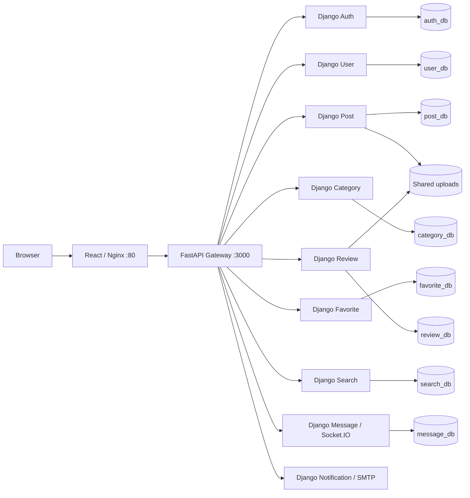

# Used Goods Marketplace — Python Microservices

A marketplace for second-hand goods, with moderated listings, image uploads, search, favorites, seller reviews, and real-time conversations. The React client uses a FastAPI gateway; nine Django services own the business logic. The backend was migrated from Node.js while preserving existing HTTP contracts, MySQL schemas, records, and upload files.

This is a development/portfolio project. The first [GitHub Actions CI run](https://github.com/vjettejv/hethongmuabandocu/actions/runs/37643230502) passed all three jobs on commit `6ca3c21`. Image publishing is configured; production deployment has not been performed.

## Architecture



| Component | Framework | Internal port | Owned database | Responsibility |
|---|---|---:|---|---|
| api-gateway | FastAPI / HTTPX | 3000 | — | HTTP routing and Socket.IO transport proxy |
| auth-service | Django / DRF | 3001 | auth_db | Registration, OTP, login, JWT |
| user-service | Django / DRF | 3002 | user_db | User profiles and Auth ID mapping |
| post-service | Django / DRF | 3003 | post_db | Listings, moderation, image uploads |
| category-service | Django / DRF | 3004 | category_db | Category lookup and administration |
| message-service | Django / python-socketio / ASGI | 3005 | message_db | Conversations, persisted notifications, real-time events |
| notification-service | Django / DRF | 3006 | — | SMTP email delivery and development mock mode |
| review-service | Django / DRF | 3007 | review_db | Seller reviews and review images |
| search-service | Django / DRF | 3008 | search_db | MySQL search projection and synchronization |
| favorite-service | Django / DRF | 3009 | favorite_db | Favorite toggles and listing enrichment |
| frontend | React 18 / Vite / Nginx | 80 | — | Browser application and reverse proxy |

Root Compose runs **19 containers: 10 backend + 8 MySQL + 1 frontend/Nginx**. Notification is database-free. There are nine persistent volumes: eight database volumes and one shared upload volume. Node/npm is frontend tooling; the canonical backend runtime is Python.

## Quick start

Requirements: Git, Docker with Compose v2 and Linux containers, and Python 3.12 for the volume bootstrap helper. Node 18/npm is needed for host frontend development/tests. Allow enough disk space for eleven images and eight MySQL instances; Docker must be running.

```bash
cp .env.example .env
```

Fill the blank fields privately. For a **new installation**, choose random `PYTHON_SECRET_KEY`, `JWT_SECRET`, and `MYSQL_ROOT_PASSWORD`; set `PYTHON_DB_USER=root` and `PYTHON_DB_PASSWORD` to that root password. For an **existing installation**, retain its current keys, database credentials, and volumes. Leave `MOCK_EMAIL=true` for local work unless SMTP has been deliberately configured. Never commit `.env`.

```bash
python tools/bootstrap_volumes.py --create-missing
docker compose config --quiet
docker compose up -d --build
docker compose ps
```

Open [the application](http://localhost/) or [gateway API documentation](http://localhost:3000/docs). The bootstrap helper creates missing canonical volumes only. Fresh volumes initialize from `seeds/schema/` with **schema only**, without historical accounts or personal data. Business tables are initially empty; register a new user and create categories/listings through the supported application/API workflow. No private fixture dump is needed. Existing volumes are not reinitialized by MySQL.

Stop without deleting data:

```bash
docker compose down
```

The named data volumes are external. Do not delete or replace them when upgrading an existing installation. Changing `.env` does not change the password already stored in a MySQL volume.

With mocked email, registration does not send an OTP to your inbox. Open a private database session to verify your own development account:

```bash
docker compose exec auth-db sh -c 'MYSQL_PWD="$MYSQL_ROOT_PASSWORD" exec mysql -uroot auth_db'
```

At the MySQL prompt, query only your own address: `SELECT id, otp FROM users WHERE email='your-own-dev-address@example.invalid';`. Use that OTP on the verification page. Fresh databases have no administrator; moderation requires a deliberately provisioned account with the existing admin role. Real email requires `MOCK_EMAIL=false` and private `SMTP_HOST`, `SMTP_PORT`, `SMTP_USER`, and `SMTP_PASS` configuration.

For troubleshooting, inspect `docker compose logs --tail 100 api-gateway post-service`. Start Docker if its daemon is unavailable; rerun the bootstrap helper if an external volume is missing. A fresh, empty marketplace is expected until categories and listings are created. Reload the browser after rebuilding frontend assets. Keep database output, OTPs and private logs local.

## Features and contracts

- Register, verify an OTP, log in, and edit a profile using the preserved JWT contract.
- Create image-backed listings; moderation follows **pending → approved / rejected**. Only approved listings appear in public results.
- Browse categories, query search, and save favorites.
- Review sellers and upload review images.
- Exchange persisted messages and receive real-time message/notification events.
- Inspect health, readiness, request-ID logs, and API schemas.

Protected HTTP requests use `Authorization: Bearer <token>`. Profile IDs differ from Auth IDs; resolve their mapping through User. Exact route aliases, request fields and response shapes are recorded in [contracts/endpoints.json](contracts/endpoints.json). Services expose `/health`, `/ready`, `/schema/` and `/docs/` on internal ports; not every port is published to the host.

Socket.IO uses `/socket.io/`. Preserved events are `join_user_room`, `receive_message`, and `receive_notification`; messages are written through HTTP. Message runs **one Uvicorn worker** because room membership lives in process memory. Room identity retains legacy behavior and does not authenticate room access. Multiple workers require a shared Socket.IO manager and verification of room delivery.

## Verification

Create/activate a Python 3.12 virtual environment, then:

```bash
python -m pip install -r requirements-dev.lock.txt
python -m pip check
python tools/verify_foundation.py
npm ci --prefix do-cu-frontend
node do-cu-frontend/tests/frontend-contracts.test.js
npm run build --prefix do-cu-frontend
python tools/verify_ci.py --validate-only
python tools/verify_ci.py --smoke
```

`verify_foundation.py` runs Ruff lint/format, checks all nine Django services, imports the gateway, and runs Python unit/contract tests. `verify_ci.py` builds all eleven images and runs the canonical suite against a disposable 19-container stack. Omit `--smoke` for the full 48-case integration suite. It uses generated credentials, schema-only templates, synthetic records, UUID-owned volumes, and a random loopback HTTP port. It does not mount the canonical databases/uploads or require a developer `.env`.

Current checks cover **521 Python unit/contract cases, 11 frontend checks, and 48 full-system cases**. CI uses the unchanged `integration-tests/phase7` suite. It checks authentication, profiles, moderation, uploads, search, favorites, reviews, messages, real-time events, and service health. Use the disposable runner for integration; running multiple eight-database stacks concurrently requires sufficient Docker memory.

Host frontend development uses `npm run dev --prefix do-cu-frontend` with the backend running. Activate a Python 3.12 virtual environment before source checks; on Ubuntu, `mysqlclient` needs a compiler, `pkg-config` and `default-libmysqlclient-dev`. Contract checks read the original Node baseline through Git history, so use a full clone rather than a shallow clone.

## CI and image release configuration

[CI](.github/workflows/ci.yml) checks pull requests and pushes to `develop`/`main`: Python 3.12 quality, frontend install/contracts/build, and isolated Docker integration. Pull requests run the critical smoke selection; branch/manual/release validation runs the full selection. Dependencies are locked and actions are pinned by commit SHA.

[Docker images](.github/workflows/docker-publish.yml) validates CI before building ten backend images plus frontend for GHCR. Version tags such as `v1.2.3` enable publication; manual dispatch defaults to build-only. Names are `ghcr.io/vjettejv/hethongmuabandocu-<service>`, with version and full commit-SHA tags; stable version releases also receive `latest`. These workflows build and validate images; deployment is separate. CI uploads only JUnit XML and a non-sensitive result summary for seven days.

## Known limitations

- Development Compose is not a production deployment; TLS, centralized secrets, monitoring, scaling, and backup/restore operations need separate deployment work.
- JWT/OTP and room authorization retain compatibility behavior; Socket.IO room identity is not a hardened authentication boundary.
- Category creation and notification writes retain legacy access boundaries; not every administrative alias has uniform authorization.
- Search synchronization is best-effort; existing projection drift is audited and preserved rather than silently rebuilt.
- Message room state supports one worker. There is no Redis/shared Socket.IO manager.
- File retention on listing/review deletion follows existing contracts; shared storage is not an object-storage system.
- SMTP is mocked by default. External mail delivery requires separately supplied credentials and testing.
- Node 18 remains the existing frontend toolchain; upgrading it is outside this migration phase.
- The existing frontend dependency audit reports 17 advisories (1 low, 7 moderate, 9 high); dependency upgrades require separate compatibility checks.

## Repository guide

```text
.github/workflows/       CI and image publishing configuration
api-gateway/            FastAPI gateway
*-service/              Nine Django business services
do-cu-frontend/         React/Vite source and Nginx image
seeds/schema/           Empty-volume schema initialization
contract-tests/         Contract and final tooling checks
integration-tests/      Current Python full-system integration suite
tools/                  Verification, bootstrap, and safety helpers
docker-compose.yml      Canonical Python-only runtime
```

See the [frontend README](do-cu-frontend/README.md), [contract inventory](contracts/README.md), and [contract test README](contract-tests/README.md). Removed migration reports, retired Node parity fixtures and old Compose overlays remain recoverable from Git history at `6ca3c21`. Current startup and verification instructions are kept here.
