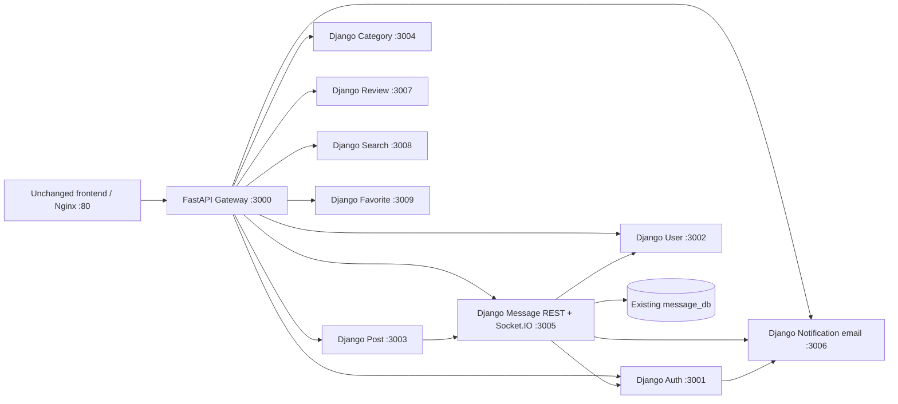

# PHASE 6 IMPLEMENTATION REPORT

Status: COMPLETE. Canonical Message and Notification are Python. All 865 pytest tests
passed across local foundation, isolated Phase 6 and unchanged Phase 2–5 regressions.
Canonical E2E passed ten check groups. Phase 7 has not started.

## 1. Summary

Phase 6 adds Django Message REST, a Python Socket.IO ASGI server, and DB-less Django
Notification/email. It restores the intended notification list route. Frontend,
Gateway/Auth/User/Post/Category/Review/Search/Favorite sources stay unchanged.
Phase 7 is not performed. Original Node sources/images remain available.

## 2. Starting State

Repository `D:\workspacecuachjp\KienTrucPM`, branch `develop`, HEAD
`92777b8f70b6717e3ffd12657c725b2ea4e3d0ab`. Worktree already contained Phase 1–5
changes and an unstaged `.gitignore`; staging was empty. Docker Desktop was initially
stopped and was started without deleting/recreating the existing stack. Runtime
baseline was captured after startup. Eight backend services were Python; Message and
Notification were Node. Prior results: 442 local, Phase 2/3/4/5: 35/51/97/103 tests.

## 3. Final Canonical Architecture

The canonical stack has FastAPI Gateway and nine Django services. Message
owns REST and Socket.IO in one ASGI process. Notification owns email only, with no DB.
Eight existing MySQL containers, frontend Nginx :80 and shared uploads remain.
All ten passed health/readiness after cutover and Search restoration.



## 4. Gateway Route Matrix

Gateway code and service DNS remain unchanged.

| Public route | Service/port | Runtime |
|---|---|---|
| `/auth/*` | Auth 3001 | Django |
| `/users/*` | User 3002 | Django |
| `/posts/*`, `/admin/posts/*`, `/uploads/*` | Post 3003 | Django |
| `/categories/*` | Category 3004 | Django |
| `/messages/*` | Message 3005 | Django REST |
| `/socket.io/*` HTTP + WebSocket | Message 3005 | Python Socket.IO ASGI |
| `/notifications/email` | Notification 3006 `/email` | Django |
| `/reviews/*` | Review 3007 | Django |
| `/search/*` | Search 3008 | Django |
| `/favorites/*` | Favorite 3009 | Django |

In-app notification REST uses `/messages/notifications`; it is separate from email.

## 5. Message Architecture

Local `messaging` modules separate unmanaged models, projection, selectors, services,
JWT handling, dependency HTTP, REST and realtime transport. No business modules are
imported from another service. Django executes synchronous REST in a thread; event
emission is scheduled onto the same ASGI event loop that owns Engine.IO rooms/queues.
The emit future is awaited and sends are serialized with an async lock. DB writes
autocommit before optional email/realtime effects. Foundation routes remain available.

## 6. Message Database Mapping

| Existing physical table | Explicit Django mapping |
|---|---|
| `message_db.messages` | `id`, `senderId`, `receiverId`, `content`, `isRead`, `createdAt`, `updatedAt` |
| `message_db.notifications` | `id`, `userId`, `title`, `message`, `isRead`, `link`, `createdAt`, `updatedAt` |

Both models use `managed=False`, explicit `db_table`/`db_column`, nullable legacy
boolean/link fields, existing IDs and UTC camelCase projections. No FK, Conversation,
schema migration, index change or Sequelize sync is introduced. Existing DATETIME
precision is zero; create responses retain milliseconds while reloaded rows reflect
legacy storage precision. No ID counter is reset.

## 7. Message REST Endpoint Matrix

| Endpoint (service local) | Node | Django | Parity |
|---|---|---|---|
| GET `/contacts` | JWT, counterpart dedupe, User enrichment | Same | Differential tests |
| GET `/:contactId` | JWT, both directions, oldest first, `{data:[]}` | Same | Differential tests |
| POST `/` | JWT sender, persist/email/emit, 200 `{data}` | Same | Differential tests + real event |
| POST `/notifications` | Public, persist/emit, 200 `{success:true,data}` | Same | Differential tests + real event |
| GET `/notifications` | Shadowed history route | Intended own newest-first list, max 50 | Intentional fix |
| PUT `/notifications/read-all` | JWT, own unread only, `{success:true}` | Same | Differential DB assertions |

Empty history, unknown counterparts, Unicode, missing/invalid fields, string receiver
IDs, sender spoofing, authentication failures and generated timestamps are covered.
When create omits `link`, response/event omit it; reloaded notifications contain null.

## 8. Notification Route Shadow Fix

Node registers `GET /:contactId` before `GET /notifications`. Its live request selects
message history with contact `"notifications"`, usually `{data:[]}`. Django dispatches
static notification routes first. Tests assert the actual old response and separately
invoke the legacy dormant `getNotificationsHandler` read-only to compare its intended
50-row result. Read-all remains isolated to the authenticated user's unread rows.

## 9. Auth→Message / JWT

Local HS256 validation uses the existing shared key and `id`/`roleId`/`iat`/`exp`
claims. The sender comes from `claims.id`; a body `senderId` cannot replace it.
Missing/invalid/wrong-key/expired tokens are compared with Node. Canonical E2E uses
actual Auth-issued tokens after register/OTP/login, not handcrafted replacement tokens.

## 10. Message→User Integration

Contacts call real User HTTP, use `fullName` as legacy display/username, and retain
the missing-profile/HTTP/network/invalid-JSON fallback. Contacts preserve Node's
integer object-key enumeration order, not a newly invented latest-first contact order.
Dependency request IDs propagate from Python. No direct User DB access exists in
Message and no bounded concurrency rewrite changes enrichment ordering.

## 11. Message→Auth Integration

Send persists first, then retrieves receiver Auth by HTTP for email. Unknown receiver,
Auth HTTP error, malformed JSON or transport failure do not undo the message. Tests
use actual Python Auth plus an opt-in fixture failure/capture transport.

## 12. Message→Notification Integration

Receiver email triggers the existing Vietnamese subject/text via HTTP `/email`.
The call is synchronous and awaited; its HTTP status is intentionally ignored.
Tests prove DB persistence during a delayed email call, no premature socket event,
then response/event equality. HTTP/JSON/network failure preserves message success.
Three-second per-operation HTTP timeouts are an explicit bounded operational change.

## 13. Post→Message Integration

Existing Post source/image/service URL stays unchanged. Real Python Post moderation
calls public Message `/notifications`, persists in Message DB and emits to the post
owner. Approve/reject and subsequent status transitions are checked. Repeating the
same status retains Post's existing behavior: no extra notification/event.

## 14. Socket.IO Architecture

`python-socketio==5.17.0`, `python-engineio==4.14.0` and Uvicorn wrap Django with
`socketio.ASGIApp`. Message starts **one Uvicorn worker**. REST and sockets share the
same AsyncServer, event loop and in-memory room state. No Redis, durable broker,
multi-process adapter, custom websocket replacement, realtime send or typing event.

The earlier Phase 2 raw upgrade assertions exposed an extra Python Engine.IO NOOP
`6` before namespace CONNECT `40` when no outstanding poll drained the queued NOOP.
A narrow ASGI send adapter suppresses this optional text control frame only for
Engine.IO 4 WebSocket upgrades with an existing sid. Polling NOOP, fresh WebSocket,
probe/PONG, heartbeat, CONNECT, app data and binary attachments are preserved. It
delegates all protocol and room handling to python-socketio; no library monkeypatch.
Four unit cases and unchanged Phase 2 wire tests validate this compatibility detail.
The queued NOOP behavior is visible in the
[pinned Engine.IO implementation](https://github.com/miguelgrinberg/python-engineio/blob/v4.14.0/src/engineio/async_socket.py).

## 15. Socket.IO Protocol Compatibility

Default namespace, `/socket.io/`, Engine.IO 4, WebSocket, polling and polling-to-
WebSocket upgrade are tested with the unchanged frontend's installed Socket.IO 4.x
client. Both direct service and Gateway are exercised; canonical E2E additionally
uses Nginx :80. This is actual event verification, beyond a successful handshake.
The supported protocol relationship is documented by the
[official server documentation](https://python-socketio.readthedocs.io/en/stable/server.html).

## 16. Realtime Message Delivery

`join_user_room` → POST message → `receive_message` is verified. Receiver room payload
equals the REST create payload, with all camelCase fields. Two receiver sockets get
the event; unrelated room and sender sockets do not. Offline delivery persists in
MySQL and remains retrievable through history. Canonical Gateway/Nginx E2E passed.

## 17. Realtime Notification Delivery

Public notification create and real Post moderation produce `receive_notification`.
Payload/title/owner and persistence are checked; unrelated rooms stay empty. Authenticated
list/read-all assertions verify the reachable route and ownership. No new event family.

## 18. Room Semantics

Existing numeric and string scalar IDs join `user_<id>` in the default namespace.
Emission targets the receiver, with no broadcast or sender echo. Multiple sockets can
join a user's room. The server preserves permissive socket CORS; Django REST middleware
does not intercept Engine.IO. Rooms are held in memory in one process.

## 19. Reconnect Behavior

Disconnect drops membership. A fresh connection explicitly rejoins, then receives
subsequent events. Offline messages are read via history; no event replay or durable
room state is claimed. The unchanged client join event is preserved.

## 20. Socket Security Debt

Room joins remain unauthenticated: a client can claim another user's scalar ID.
REST authentication does not secure this join. This is preserved compatibility debt,
not a claim of secure room ownership. Future socket authentication needs explicit
frontend rollout, existing-client behavior and reconnect tests.

## 21. Notification Architecture

Django/DRF `email_delivery` modules implement public POST `/email`, a mock policy and
stdlib SMTP MIME transport. `DATABASES={}` and `DATABASE_BACKED=False`; no email queue
table, model, DB server or Message DB dependency. `/ready` is DB-less. Success/error
envelopes and request-ID metadata use the existing foundation behavior.

## 22. Mock Email Compatibility

Mock iff `NODE_ENV != production`, exact `MOCK_EMAIL == "true"`, or empty SMTP user.
Response: 200 `{"message":"Email queued (Mock)","mock":true}`. Missing `to`/`subject`
remain accepted in mock mode. Three independent Node/Python environment variants
exercise all conditions. Canonical migration retains its existing mock configuration.

## 23. SMTP Compatibility

Local fake SMTP verifies sender display/address, recipient envelope, generated
message ID, Unicode subject and decoded text/HTML/multipart contents. ESMTP MAIL
`SIZE` parameters are handled as envelope metadata. Missing recipient returns legacy
500. Sink rejection returns a safe Python 500. Real SMTP uses default port 587,
ordinary SMTP, opportunistic STARTTLS if advertised, EHLO/authentication and a finite
timeout. Unit tests check advertised STARTTLS and non-TLS sequencing. No external
email delivery or production deliverability test is performed.

## 24. Auth→Notification Regression

Earlier Auth differential registration/OTP cases use Python Notification in mock mode.
Canonical E2E registers three unique `.invalid` accounts, queries each generated OTP
privately, verifies, logs in and checks real User profile creation. Tokens/OTPs/private
email bodies are neither printed nor saved in recovery metadata.

## 25. Intentional Divergences

Only these behavioral/operational changes are intentional: restore reachable GET
notification list; finite dependency/SMTP/realtime waits; metadata-only logs; normalize
SMTP transport exceptions to `{"error":"Email delivery failed"}`. The upgrade NOOP
adapter preserves the legacy Node packet ordering described in section 14. Framework foundation
health/readiness/OpenAPI routes coexist with legacy business routes. No JWT-only room
join, new role restriction, broker, email validation policy or business schema change.

## 26. Security Debt Deferred

Unauthenticated room joins and permissive socket CORS; public internal notification
and email endpoints; existing shared/local JWT trust and key quality; no revocation;
no service-to-service authentication, chat authorization expansion, moderation role
redesign, rate limit, spam controls or durable email delivery. Existing credentials
are preserved privately rather than rewritten during parity migration.

## 27. Tests

All suites PASS; **865 pytest tests total**, plus ten grouped canonical E2E checks,
eight Compose configuration combinations, readiness and preservation audits.

| Suite | Result | Evidence |
|---|---|---|
| Local foundation | 492 PASS; 22/22 commands | `.artifacts/phase6/local-final.log` |
| Phase 6 isolated | 87 PASS, no error; 311.40s | `.artifacts/phase6/parity-final.log` |
| Phase 2 regression | 35 PASS; 199.71s | `.artifacts/phase6/regression-phase2.log` |
| Phase 3 regression | 51 PASS; 229.29s | `.artifacts/phase6/regression-phase3.log` |
| Phase 4 regression | 97 PASS; 1119.81s | `.artifacts/phase6/regression-phase4.log` |
| Phase 5 regression | 103 PASS; 1186.85s | `.artifacts/phase6/regression-phase5.log` |
| Canonical E2E | 10 check groups PASS, rerun on final image | `.artifacts/phase6/canonical-e2e.log` |

Local count: Auth 40, User 52, Post 69, Category 34, Message 47, Notification 35,
Review 44, Search 25, Favorite 33, Gateway 99, contracts 14. This increases the
pre-Phase-6 local count from 442 to 492. The Phase 6 integration suite contains
20 email, 54 Message REST/dependency and 13 realtime cases. Exact commands:

```powershell
.\.venv\Scripts\python.exe tools/verify_foundation.py
$env:PHASE6_TEST='1'
.\.venv\Scripts\python.exe -m pytest -c integration-tests/phase6/pytest.ini integration-tests/phase6 -q
.\.venv\Scripts\python.exe tools/verify_phase6_runtime.py
.\tools\verify_phase6_regressions.ps1 -Phase 2
.\tools\verify_phase6_regressions.ps1 -Phase 3
.\tools\verify_phase6_regressions.ps1 -Phase 4
.\tools\verify_phase6_regressions.ps1 -Phase 5
.\.venv\Scripts\python.exe tools/verify_phase6_state.py --preservation --runtime --files
.\.venv\Scripts\python.exe tools/audit_phase5_search.py --compare .artifacts/phase6/search-drift-before.json
```

Use the private environment/Compose order in the [runbook](phase-6-runbook.md).
Logs and ownership metadata are local ignored files under `.artifacts/phase6`.
Initial test harness failures are retained in `parity-initial.log` and were diagnosed
without weakening behavior assertions: MIME parsing/ESMTP SIZE, SQL display charset,
dormant selector name and isolated Post upload directory. The later Phase 2 regression
identified the actual Engine.IO control-frame ordering detail, corrected in ASGI
without changing earlier assertions. Final logs supersede intermediate runs. Canonical
E2E was rerun successfully on the final Message image. One subsequent full suite
passed all 87 assertions but hit a stale SMTP-sink HTTP keep-alive connection during
fixture teardown. Host-side REST test connections now avoid pooling; application
HTTP and persistent Socket.IO behavior/assertions are unchanged. The final suite
was rerun and passed all 87 cases with successful cleanup.

## 28. Phase 2 Regression

PASS: 35/35 in 199.71 seconds. Original assertions; Notification candidate Python; Socket.IO points to
canonical Python Message. Original Auth Node reference and guarded clones preserved.

## 29. Phase 3 Regression

PASS: 51/51 in 229.29 seconds. Original assertions; `message-cross` candidate uses Python Message against
the Python User candidate. Earlier assertion source and historical test names unchanged.

## 30. Phase 4 Regression

PASS: 97/97 in 1119.81 seconds. Original assertions; candidate Post→Message uses Python Message, and
Phase 5's Search/Favorite candidate upgrades remain. Node reference side stays Node.

## 31. Phase 5 Regression

PASS: 103/103 in 1186.85 seconds. Original assertions; Post→Message candidate now Python. Review/Favorite/
Search/Post assertions and schemas are unchanged. No shared legacy upload mutation.

## 32. Docker Verification

Two target images built from pinned locks. Eight canonical/test/E2E/rollback/regression
Compose combinations validated with `config --quiet`. Only Message and Notification
were cut over after 87/87 isolated tests passed. Canonical E2E passed ten check groups.
No live rollback is required; rollback overlay is validated only. E2E temporarily
switches only Search's DB to an owned schema; restore uses the same image. This avoids
new Post IDs colliding with legacy orphan Search IDs. No `down -v`/prune/remove-orphans.

## 33. Canonical Runtime

All services are healthy and passed `/health` and `/ready` inside their containers.
All Phase 6 and previous-phase fixtures are stopped; 19 canonical containers remain
running (ten backend Python services, eight original MySQL servers, one frontend).

| Canonical container | Port | Runtime/image | Result |
|---|---|---|---|
| api-gateway | 3000 | FastAPI `kientrucpm-api-gateway` | healthy/ready |
| auth-service | 3001 | Django `kientrucpm-auth-service` | healthy/ready |
| user-service | 3002 | Django `kientrucpm-user-python-phase3` | healthy/ready |
| post-service | 3003 | Django `kientrucpm-post-python-phase4` | healthy/ready |
| category-service | 3004 | Django `kientrucpm-category-python-phase3` | healthy/ready |
| message-service | 3005 | Django + ASGI `kientrucpm-message-python-phase6` | healthy/ready |
| notification-service | 3006 | Django `kientrucpm-notification-python-phase6` | healthy/ready |
| review-service | 3007 | Django `kientrucpm-review-python-phase5` | healthy/ready |
| search-service | 3008 | Django `kientrucpm-search-python-phase5` | healthy/ready |
| favorite-service | 3009 | Django `kientrucpm-favorite-python-phase5` | healthy/ready |

Gateway/Auth/User/Post/Category/Review/Favorite and frontend retain exact baseline
container ID, image ID and start time. Search retains its exact image; its container
was recreated for the owned E2E schema and restored to `search_db`. Message and
Notification have the two new Python images. Shared JWT, service DNS and Post/Review
upload mounts are checked. Message/Notification service ports remain internal; public
E2E uses Gateway 3000 and Nginx 80. An initial host-port readiness probe was corrected
to container-internal probes without changing network exposure.

## 34. Database Safety

Pre-cutover and post-cleanup preservation PASS for all eight schemas, row counts and
full-row content hashes. Search content hash and every drift count also match.
Baseline and final counts:

| DB | Business rows |
|---|---|
| Auth | users 244 |
| User | userprofiles 6 |
| Post | posts 4463, images 35 |
| Category | categories 5 |
| Message | messages 31, notifications 2 |
| Review | reviews 4 |
| Search | searchindices 4872 |
| Favorite | favorites 3 |

Owned fixtures are schema-only clones, tracked separately. Canonical E2E uses new
UUID-marked accounts and guarded cleanup, never a broad legacy reset. Natural ID
counter advances are allowed. Existing Search drift (409 orphan rows, 11 title/
description/price/status/categoryName mismatches, 8 categoryId, 10 image mismatches,
one ambiguous image row) is audited read-only and is not repaired.

## 35. Filesystem Safety

46 baseline upload entries include byte hashes and symlink checks; pre-cutover and
post-cleanup equality PASS. E2E created JSON posts without images. Post and Review keep the original
`kientrucpm_shared_uploads` volume. Target service Node code, prior migration sources,
frontend and `HUONG_DAN_TRIEN_KHAI.md` are hash protected. 518/534 baseline files
are byte-identical; 16 allowed edits and 43 new files are listed separately.

## 36. Files Created

43 files. Complete Phase 6 list:

`	ext
contracts/messages/phase-6.json
contracts/notifications/phase-6.json
docker-compose.phase6.e2e.yml
docker-compose.phase6.regression.yml
docker-compose.phase6.rollback.yml
docker-compose.phase6.test.yml
docker-compose.phase6.yml
docs/migration/phase-6-files.md
docs/migration/phase-6-implementation-report.md
docs/migration/phase-6-runbook.md
integration-tests/phase6/conftest.py
integration-tests/phase6/pytest.ini
integration-tests/phase6/test_email_parity.py
integration-tests/phase6/test_message_parity.py
integration-tests/phase6/test_realtime.py
message-service/messaging/asgi.py
message-service/messaging/authentication.py
message-service/messaging/clients.py
message-service/messaging/exceptions.py
message-service/messaging/http.py
message-service/messaging/models.py
message-service/messaging/realtime.py
message-service/messaging/selectors.py
message-service/messaging/serializers.py
message-service/messaging/services.py
message-service/messaging/urls.py
message-service/messaging/views.py
message-service/tests/test_messaging.py
notification-service/email_delivery/exceptions.py
notification-service/email_delivery/http.py
notification-service/email_delivery/mailer.py
notification-service/email_delivery/services.py
notification-service/email_delivery/urls.py
notification-service/email_delivery/views.py
notification-service/tests/test_email.py
tools/phase6_socket.py
tools/prepare_phase6_tests.py
tools/runtime/phase6-dependencies.cjs
tools/runtime/phase6-smtp.cjs
tools/runtime/phase6-socket-client.cjs
tools/verify_phase6_regressions.ps1
tools/verify_phase6_runtime.py
tools/verify_phase6_state.py
`

## 37. Files Modified

16 files. Complete Phase 6 list:

`	ext
message-service/.env.example
message-service/Dockerfile.python
message-service/common/logging.py
message-service/config/asgi.py
message-service/config/settings.py
message-service/config/urls.py
message-service/requirements.lock.txt
message-service/requirements.txt
message-service/tests/test_health.py
notification-service/.env.example
notification-service/common/logging.py
notification-service/config/settings.py
notification-service/config/urls.py
notification-service/tests/test_health.py
requirements-dev.lock.txt
requirements-dev.txt
`

## 38. Git Status

Previous Phase 1–5 work remains unstaged/untracked as received. Phase 6 is distinguished
by the 534-file start-of-phase hash baseline and the separate file manifest. No stage,
commit, push, reset, clean or legacy source deletion. Branch/HEAD and empty index remain.

## 39. Known Issues

Existing Search drift remains; short legacy JWT key remains; Post notifications/email
are best effort; Message send remains synchronously coupled to email; no durable event
replay or multi-worker room adapter. External SMTP and multi-replica deployment are not
certified. Existing Gateway local tests produce one Starlette deprecation warning.
No unresolved Phase 6 functional/realtime blocker remains after final verification.

## 40. Phase 7 Readiness

Ready to plan `PHASE 7 — FULL INTEGRATION + CONTROLLED NODE RETIREMENT` with all Phase 6
and previous-phase tests green. Phase 7 has not started and no Node retirement is done.
There is no remaining Phase 6 integration blocker. Production/retirement gates remain:
full system acceptance, explicit disposition of the documented security debt, production
SMTP configuration/deliverability, a shared realtime adapter if multiple workers are
desired, and an approved Node rollback/retention policy. Existing Search drift stays
outside Phase 6 scope. Legacy sources/images/data remain.

## 41. Suggested Commits

Suggestions only; no commits created:

```text
feat(messages): migrate message REST service to Django
feat(messages): preserve Socket.IO protocol with Python ASGI
feat(notifications): migrate email service to Django
fix(messages): restore reachable notification list route
test(messages): add Node Python REST parity
test(messages): add Socket.IO end-to-end compatibility
test(notifications): add mock and SMTP transport parity
test: add full Python cross-service messaging regressions
docs: document phase 6 migration
```
