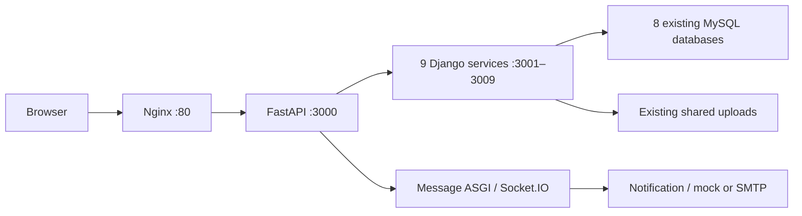

# PHASE 7 IMPLEMENTATION REPORT

## 1. Summary

The canonical backend is fully Python: one FastAPI Gateway and nine Django services.
The unchanged frontend/Nginx, eight existing MySQL databases and shared uploads volume
remain in place. The root Compose is the ordinary entry point. Node business source was
retired only after all parity, integration, preservation and recovery gates passed.
Two complete down/build/start cycles and the final 48-case integration suite passed.
Final verification status and the complete file inventory are recorded below.

## 2. Starting State

Work continued directly on `develop` at immutable Node baseline
`92777b8f70b6717e3ffd12657c725b2ea4e3d0ab`. Phase 1–6 Python work was already uncommitted;
the starting root Compose and cumulative overlays still retained Node source/runtime
definitions. Phase 6 supplied Python Message/Notification, real Socket.IO compatibility,
eight preserved database schemas and known Search drift. Before mutation, Phase 7 saved
577 non-ignored file hashes, Git status, database schema/count/full-content snapshots,
46 upload entries, runtime/volume/network inventory and read-only Search drift.

The existing untracked `HUONG_DAN_TRIEN_KHAI.md` and already modified `.gitignore` were
protected byte-for-byte. Frontend source, dependencies, lockfile and Nginx configuration
were also protected. Existing keys and database credentials were preserved privately.

## 3. Final Architecture

Requests enter unchanged Nginx on port 80, reach FastAPI on 3000, and are proxied to
Python services on their original ports. HTTP calls, database writes, shared file access
and Socket.IO delivery are exercised through this real stack. Message combines Django
HTTP with python-socketio ASGI in one Uvicorn worker. Notification is DB-less.



Final directory tree (business modules shown; shared config/common/tests also retained):

```text
KienTrucPM/
├── docker-compose.yml               canonical Python stack
├── .env.example                     blank secret fields; private .env is ignored
├── api-gateway/                     app/; Python Dockerfile; requirements
├── auth-service/                    authentication/; Python Dockerfile; requirements
├── user-service/                    profiles/; Python Dockerfile; requirements
├── post-service/                    posts/; Python Dockerfile; requirements
├── category-service/                categories/; Python Dockerfile; requirements
├── favorite-service/                favorites/; Python Dockerfile; requirements
├── review-service/                  reviews/; Python Dockerfile; requirements
├── search-service/                  search_app/; Python Dockerfile; requirements
├── message-service/                 messaging/; Python Dockerfile; requirements
├── notification-service/            email_delivery/; Python Dockerfile; requirements
├── do-cu-frontend/                  unchanged Vite / Socket.IO client / Nginx
├── integration-tests/phase2–phase7/ retained parity + new full-system suite
├── contract-tests/; contracts/      immutable baseline oracles and contracts
├── docker-compose.phase*.test.yml   opted-in parity fixtures
├── docker-compose.phase*.rollback.yml historical guarded references
├── docker-compose.phase7.e2e.yml     owned Search shadow only
├── docker-compose.phase7.rollback-test.yml isolated recovery project
├── tools/                          verification, safety, export and recovery
├── docs/migration/                 historical reports + Phase 7 evidence
├── seeds/                          unchanged existing schemas/data
└── .artifacts/phase7/               ignored local evidence, backups and reference cache
```

## 4. Final Service Matrix

Ports below are container ports; Gateway :3000 and frontend :80 are public. Database
host mappings remain the original 3307–3314 mappings. Business service ports stay internal.

| Service | Framework | Port | Database | Runtime |
|---|---|---:|---|---|
| api-gateway | FastAPI | 3000 | — | Uvicorn / Python |
| auth-service | Django REST Framework | 3001 | auth_db | Gunicorn / Python |
| user-service | Django REST Framework | 3002 | user_db | Gunicorn / Python |
| post-service | Django REST Framework | 3003 | post_db | Gunicorn / Python |
| category-service | Django REST Framework | 3004 | category_db | Gunicorn / Python |
| message-service | Django + python-socketio ASGI | 3005 | message_db | Uvicorn, one worker / Python |
| notification-service | Django REST Framework | 3006 | None | Gunicorn / Python |
| review-service | Django REST Framework | 3007 | review_db | Gunicorn / Python |
| search-service | Django REST Framework | 3008 | search_db | Gunicorn / Python |
| favorite-service | Django REST Framework | 3009 | favorite_db | Gunicorn / Python |
| frontend | unchanged SPA | 80 | — | Nginx; Node only at frontend build |
| eight database services | MySQL 8.0 | 3306 each | original eight schemas | MySQL |

## 5. Full End-to-End Test Results

Phase 7 has 48 pytest cases: one complete business lifecycle, 37 route/method inventory
cases, and ten backend health/readiness/documentation/schema cases. The lifecycle performs
many assertions; these are not reported as separate pytest cases. All final cases PASS.

| Flow | Actual verification / final result |
|---|---|
| Register / OTP | Three synthetic `.invalid` users; register 201; read their own six-digit OTP from DB; verify and create profiles; PASS |
| Login / JWT | Real login and HS256 tokens with id, roleId=1, iat, exp and 86400-second lifetime; PASS |
| Profile | AuthId/profile ID distinction, current user, update and public read; PASS |
| Category | Read an existing category without changing the original category set; PASS |
| Post | Real multipart PNG upload, Post/Image rows, list/detail/my-posts, camelCase and read price number; PASS |
| Upload delivery | Nginx GET/HEAD/range 206/conditional 304; exact bytes; PASS |
| Search | New available Post invisible; real moderation makes approved projection searchable; fixed-decimal string price; PASS |
| Favorite | Add/check/hydrate from actual Post/remove; missing deleted Post safely skipped; PASS |
| Review | Multipart create/list/update/delete with DB metadata and physical file unlink; PASS |
| Message | Real JWTs; both directions; sender identity; actual DB rows, events and email calls; PASS |
| Socket.IO | Actual unchanged frontend socket.io-client through Nginx/Gateway/Python; polling, WebSocket, upgrade, room join; PASS |
| Moderation | Real admin update creates Search side effect and owner's realtime notification; PASS |
| Notification list | 53 owned rows with distinct timestamps; exact newest 50, own-user isolation; PASS |
| Read-all | Reading user B's notifications leaves user C's rows unchanged; PASS |
| Reconnect | Disconnect, explicit room rejoin, then receive a subsequent actual message; PASS |
| Owner delete / cleanup | Post/Image rows removed; Search marks deleted; legacy physical Post-file retention verified; journal cleans only its own rows/files; PASS |
| Email / privacy | Actual mock HTTP envelope plus per-send Notification request-ID log count; no token/OTP/password/private message body logged; PASS |

Search writes use an empty owned schema (`phase7_search_e2e`) because old orphan IDs can
collide with newly allocated Post IDs. The wrapper restores canonical `search_db` in
`finally`. Synthetic cleanup uses exact IDs, UUID ownership and filename/byte hashes.
Read-only count/schema/content/upload checks prove original data is unchanged afterward.

Latest latency smoke measurements: login 125 ms, posts 859 ms, search 63 ms, favorites
31 ms and contacts 62 ms. These are local functional observations, not load benchmarks.

## 6. Final API Contract Coverage

The complete 37-route method/path/alias matrix is in
[phase-7-contract-coverage.md](phase-7-contract-coverage.md). Route probes establish
resolution, while the lifecycle and retained Phase 2–6/local suites establish response
and side-effect behavior. The public prefixes `/auth`, `/users`, `/posts`, `/categories`,
`/favorites`, `/reviews`, `/search`, `/messages` and `/notifications` remain unchanged.
Both `/admin/posts` and `/posts/admin/posts` are retained. Category admin is POST-only;
GET to both `/admin/categories` and `/categories/admin/categories` correctly returns 405.
Uploads and `/socket.io/` remain routed through unchanged Nginx.

Read/list/detail Post prices are JSON numbers. Raw multipart-create/moderation envelopes
retain their input price string per Phase 4; Search prices remain fixed-decimal strings
or null. Existing camelCase, UTC timestamp, pagination, status/error and JWT contracts
remain covered. Prior intentional divergences remain documented: OTP bypass removal,
notification route-shadow repair, safe upload paths, finite timeouts and controlled errors.
No new category admin GET or other business route was invented.

## 7. Socket.IO Final Verification

Engine.IO 4 works with the actual frontend Socket.IO 4 client over `/socket.io/` using
polling, direct WebSocket and polling-to-WebSocket upgrade. The default namespace,
`join_user_room`, `user_<id>` rooms, `receive_message`, `receive_notification` and explicit
rejoin after disconnect all deliver actual canonical events. Moderation and message
flows also prove HTTP-triggered events, not synthetic-only socket emits. Message stays
at one ASGI worker; rooms are process-local and replay is not introduced.

## 8. Cross-Service Verification

| Call | Verification |
|---|---|
| Gateway → all nine services | Real route probes and lifecycle; original DNS/ports checked |
| Auth → Notification | Register/OTP mock notification path |
| Auth → User | Verified account creates and resolves actual profile |
| Auth-issued JWT → User | Shared HS256 identity checked locally by User; no User → Auth HTTP call |
| Post → Category | Existing category resolution and returned metadata |
| Post → Search | Actual create/moderate/delete projection behavior in owned schema |
| Post → Message | Moderation notification DB row and owner room event |
| Favorite → Post | Actual hydrated Post, removal and missing-Post handling |
| Review → Post | Post list lookup protects shared Post uploads during Review file cleanup; lifecycle and retained parity |
| Message → Auth | Real sender/recipient identity and authorization behavior |
| Message → User | Contact fullname enrichment using actual profiles |
| Message → Notification | Each actual send increases private request-ID call evidence |
| Post / Review → shared uploads | Same original volume, metadata, bytes and cleanup |

## 9. Regression Results

| Suite | Final distinct cases | Result / evidence |
|---|---:|---|
| Foundation | 492 | PASS, `foundation-final.log`; 22/22 runtime checks |
| Phase 2 | 35 | PASS; initial and post-retirement immutable-source runs |
| Phase 3 | 51 | PASS, `regression-phase3.log` |
| Phase 4 | 97 | PASS, `regression-phase4.log` |
| Phase 5 | 103 | PASS, `regression-phase5.log` |
| Phase 6 | 87 | PASS; initial and post-retirement reference runs |
| Phase 7 | 48 | PASS, `integration-final.log`, after final cold start |
| **Distinct cases** | **913** | Each suite counted once |

Pip dependency check passed. Ruff check and format checks passed. Retained assertions
were not relaxed: readers of retired Node source now use immutable `git show` objects,
and parity bind mounts use a regenerable reference export. Opt-in fixture wrappers
recreate disposable containers after network replacement and stop them in `finally`.

Earlier diagnostics were fixed and affected tests rerun: the first lifecycle assumed a
nonexistent category-admin GET and its cleanup omitted the database selection; a later
Auth parity reader referenced retired OTP source. A stopped parity fixture also retained
the deleted network ID and failed before pytest. These were harness/reference failures;
all gates were green before Node source deletion. Recovery rehearsal setup also needed
the original MySQL case setting and a guard mount where Node can resolve Sequelize.

Post-retirement Phase 2 PASS 35/35 and Phase 6 PASS 87/87; all reference fixtures
stopped. Across all recorded pytest runs, there were **2738 case executions: 2736 passed
and two earlier resolved harness/source-reader failures**. Final suites have zero
failures. Repeated executions are not added to the 913 distinct-case count. Isolated
recovery has four additional flow checks, not pytest cases. The startup failure occurred
before pytest and is excluded from case totals. Exact per-log sums are recorded in
ignored `test-executions.json`.

## 10. Docker Consolidation

Root `docker-compose.yml` now defines 19 canonical services: ten Python backends, eight
MySQL containers and unchanged frontend/Nginx. Six cumulative Python runtime overlays
were removed. All ten canonical backend `Dockerfile` paths now contain Python builds;
their `Dockerfile.dockerignore` allowlists exclude dependency caches and reference source.
Historical Python image tags remain for opted-in fixture compatibility.

The explicit project/network names and original external volume names are retained.
Existing MySQL case settings, seed bind mounts, host DB ports and Post/Review upload
permissions are preserved. `x-node-guard` is an inert Compose extension inherited by
opted-in reference fixtures; it does not inject a Node command into any canonical service.
Secret settings now use environment interpolation; ignored `.env` was created only when
absent, with privately verified existing deployment values. No existing key was rotated.

## 11. Final Start Command

From the repository, with the existing private deployment `.env` and external volumes:

```powershell
docker compose up -d --build
```

Stop with `docker compose down`. See [phase-7-runbook.md](phase-7-runbook.md) for safety,
verification and opted-in parity commands. No overlay chain is required for normal use.
This migration command expects the existing data volumes; it is not a fresh empty-DB
provisioning or production deployment procedure.

## 12. Cold Start Verification

Two full root `down` → `up -d --build` cycles passed: once after consolidation and once
after source retirement. Each down left zero running canonical project processes. Each
start created 19 new container IDs; original port and data/upload bindings matched the
recorded inventory. All ten Python backends became healthy/ready. Final inspection
proved the Node executable is absent in all ten backend images. The real 48-case suite
passed after each consolidation/retirement startup. Logs and sanitized per-container
checks are in `cold-start-consolidated.json`, `cold-start-final.json` and associated logs.

## 13. Node Retirement

Removed 125 paths: 99 legacy Node/root scripts, 20 redundant Python Docker aliases and
six obsolete runtime overlays. The 99 legacy removals comprise 86 JS files, ten backend
`package.json`, one backend lockfile and the two truncate-based root migration scripts.
Ten Node Dockerfiles were overwritten by their byte-identical Python Dockerfile content;
their paths remain. Docker ignore allowlists were promoted with canonical filenames.
No Python file, frontend file, protected guide, contract, database row or original upload
was removed. Python business implementation files were not changed in this phase.

## 14. Node Retirement Manifest

[phase-7-node-retirement-manifest.md](phase-7-node-retirement-manifest.md) contains all
125 targets, reasons, replacements and recovery sources. The ignored machine manifest
also records before hashes. Exact backups preserve uncommitted Docker/overlay content.
The deletion tool required all suite gates, actual Socket.IO delivery, DB/file safety,
recovery checks and target/recovery hashes immediately before deletion. Files were
unlinked individually under verified repository paths; only empty directories were pruned.

## 15. Legacy Recovery

Immutable commit `92777b8f70b6717e3ffd12657c725b2ea4e3d0ab` remains accessible. The tested
strategy exports 107 Node backend files from Git into ignored `.artifacts/phase7/legacy`,
verifying SHA-256. Before deletion, 100 host files matched baseline bytes and seven had
newline-only differences, with no substantive differences. Uncommitted Python aliases,
overlays and original root Compose were separately backed up; Git is not their recovery
source. Private backups may contain historical secrets and must not be published.

[phase-7-rollback.md](phase-7-rollback.md) documents immutable inspection/export, optional
separate detached worktree recovery and operational limits. The current checkout was
never reset, restored or cleaned. No worktree or Git metadata mutation was needed.

## 16. Rollback Rehearsal

Actual isolated rehearsal PASS: fresh Node Gateway boot, real bcrypt Auth login, Post
list and Category list, four checks. Images were built from the immutable export.
Project `phase7-legacy-recovery` used a separate network, tmpfs MySQL, schema-only copies
with synthetic rows, guarded Sequelize DDL and an ephemeral loopback Gateway port.
It never attached canonical volumes/network or performed live canonical rollback.
Its processes/network were removed in `finally`; reference images/cache are retained.
This proves recoverability of those four flows, not certification of every old behavior.

## 17. Database Safety

All eight canonical schema fingerprints, row counts and full-row content hashes match
the pre-phase baseline after journal cleanup. Existing named volumes and bindings are
preserved. No truncate, schema drop, synchronization, reset of IDs or volume removal ran.
Natural auto-increment advancement from synthetic tests is excluded from row/schema
preservation snapshots and was deliberately not reset.

| Database | Original rows | Final preservation |
|---|---|---|
| auth_db | users 244 | PASS |
| user_db | userprofiles 6 | PASS |
| post_db | posts 4463; images 35 | PASS |
| category_db | categories 5 | PASS |
| message_db | messages 31; notifications 2 | PASS |
| review_db | reviews 4 | PASS |
| search_db | searchindices 4872 | PASS |
| favorite_db | favorites 3 | PASS |

Owned isolated test schemas remain separate from these business schemas. No test-data
cleanup used blanket table deletion against canonical data.

## 18. Search Drift

Read-only before/after comparison PASS: 4463 Posts, 4872 Search rows, 4463 matched,
409 orphan Search rows and zero approved Posts missing. Existing mismatches remain:
title/description/price/status/categoryName 11 each, categoryId 8, imageUrl 10 and one
ambiguous image. Full Search content hash remains
`7746f1c5493c9b974668863da3e11c6056fddf29cafb4ee71edcdd51969d409f`.
No reconciliation or sync-all script was executed against canonical Search data.

## 19. Filesystem Safety

All 46 original shared-upload inventory entries remain identical by name, size, hash
and recorded link metadata, without extra synthetic files. Post and Review still mount
`kientrucpm_shared_uploads` at `/app/uploads`. Review delete removes its owned file;
legacy Post owner-delete retains its file, so the harness explicitly removes only the
synthetic file whose UUID filename and bytes it owns. Frontend, protected guide and
preexisting `.gitignore` remain byte-identical; no `.py` was deleted.

## 20. Secret Scan

Canonical runtime audit PASS with zero flagged issues. It checks literal secret
environment values in root Compose and constant secret assignments in non-test backend
Python AST, plus Python Docker builds and classified retained Node references. It does
not claim a full Git-history/entropy scan. Ignored `.env`, private backups/reference
cache and intentional test fixtures are excluded. Original secret values are neither
printed here nor copied into public docs. Runtime request-ID privacy is separately
checked by E2E. External SMTP deliverability remains environment-dependent.

## 21. Removed Files

### Legacy Node source and dependency manifests (97)

- `api-gateway/package.json`
- `api-gateway/server.js`
- `auth-service/package.json`
- `auth-service/server.js`
- `auth-service/src/commands/loginHandler.js`
- `auth-service/src/commands/registerHandler.js`
- `auth-service/src/commands/verifyOtpHandler.js`
- `auth-service/src/config/db.js`
- `auth-service/src/controllers/commandController.js`
- `auth-service/src/controllers/queryController.js`
- `auth-service/src/models/AuthUser.js`
- `auth-service/src/queries/getUserByIdHandler.js`
- `auth-service/src/queries/verifyTokenHandler.js`
- `auth-service/src/routes/index.js`
- `category-service/package.json`
- `category-service/server.js`
- `category-service/src/commands/createCategoryHandler.js`
- `category-service/src/config/db.js`
- `category-service/src/controllers/commandController.js`
- `category-service/src/controllers/queryController.js`
- `category-service/src/models/Category.js`
- `category-service/src/queries/getAllCategoriesHandler.js`
- `category-service/src/routes/index.js`
- `favorite-service/package.json`
- `favorite-service/server.js`
- `favorite-service/src/commands/toggleFavoriteHandler.js`
- `favorite-service/src/config/db.js`
- `favorite-service/src/controllers/commandController.js`
- `favorite-service/src/controllers/queryController.js`
- `favorite-service/src/middlewares/auth.js`
- `favorite-service/src/models/Favorite.js`
- `favorite-service/src/queries/checkFavoriteHandler.js`
- `favorite-service/src/queries/getMyFavoritesHandler.js`
- `favorite-service/src/routes/index.js`
- `message-service/package.json`
- `message-service/server.js`
- `message-service/src/commands/messageCommands.js`
- `message-service/src/commands/notificationCommands.js`
- `message-service/src/config/db.js`
- `message-service/src/controllers/commandController.js`
- `message-service/src/controllers/queryController.js`
- `message-service/src/middlewares/auth.js`
- `message-service/src/models/index.js`
- `message-service/src/queries/messageQueries.js`
- `message-service/src/queries/notificationQueries.js`
- `message-service/src/routes/index.js`
- `notification-service/package.json`
- `notification-service/server.js`
- `notification-service/src/commands/sendEmailHandler.js`
- `notification-service/src/config/mailer.js`
- `notification-service/src/controllers/commandController.js`
- `notification-service/src/routes/index.js`
- `post-service/package.json`
- `post-service/server.js`
- `post-service/src/commands/postCommands.js`
- `post-service/src/config/db.js`
- `post-service/src/controllers/commandController.js`
- `post-service/src/controllers/queryController.js`
- `post-service/src/middlewares/auth.js`
- `post-service/src/middlewares/upload.js`
- `post-service/src/models/index.js`
- `post-service/src/queries/postQueries.js`
- `post-service/src/routes/index.js`
- `post-service/src/utils/helpers.js`
- `post-service/sync-all.js`
- `review-service/package-lock.json`
- `review-service/package.json`
- `review-service/server.js`
- `review-service/src/commands/createReviewHandler.js`
- `review-service/src/commands/deleteReviewHandler.js`
- `review-service/src/commands/updateReviewHandler.js`
- `review-service/src/config/db.js`
- `review-service/src/controllers/commandController.js`
- `review-service/src/controllers/queryController.js`
- `review-service/src/middlewares/upload.js`
- `review-service/src/models/Review.js`
- `review-service/src/queries/getReviewsHandler.js`
- `review-service/src/routes/index.js`
- `search-service/package.json`
- `search-service/server.js`
- `search-service/src/commands/syncIndexHandler.js`
- `search-service/src/config/db.js`
- `search-service/src/controllers/commandController.js`
- `search-service/src/controllers/queryController.js`
- `search-service/src/models/SearchIndex.js`
- `search-service/src/queries/searchHandler.js`
- `search-service/src/routes/index.js`
- `user-service/package.json`
- `user-service/server.js`
- `user-service/src/commands/updateProfileHandler.js`
- `user-service/src/config/db.js`
- `user-service/src/controllers/commandController.js`
- `user-service/src/controllers/queryController.js`
- `user-service/src/middlewares/auth.js`
- `user-service/src/models/UserProfile.js`
- `user-service/src/queries/getProfileHandler.js`
- `user-service/src/routes/index.js`

### Unsafe obsolete root migration scripts (2)

- `migrate.ps1`
- `migration.sh`

### Promoted Python Docker aliases (20)

- `api-gateway/Dockerfile.python`
- `api-gateway/Dockerfile.python.dockerignore`
- `auth-service/Dockerfile.python`
- `auth-service/Dockerfile.python.dockerignore`
- `category-service/Dockerfile.python`
- `category-service/Dockerfile.python.dockerignore`
- `favorite-service/Dockerfile.python`
- `favorite-service/Dockerfile.python.dockerignore`
- `message-service/Dockerfile.python`
- `message-service/Dockerfile.python.dockerignore`
- `notification-service/Dockerfile.python`
- `notification-service/Dockerfile.python.dockerignore`
- `post-service/Dockerfile.python`
- `post-service/Dockerfile.python.dockerignore`
- `review-service/Dockerfile.python`
- `review-service/Dockerfile.python.dockerignore`
- `search-service/Dockerfile.python`
- `search-service/Dockerfile.python.dockerignore`
- `user-service/Dockerfile.python`
- `user-service/Dockerfile.python.dockerignore`

### Obsolete cumulative runtime overlays (6)

- `docker-compose.phase2.yml`
- `docker-compose.phase3.yml`
- `docker-compose.phase4.yml`
- `docker-compose.phase5.yml`
- `docker-compose.phase6.yml`
- `docker-compose.python.yml`

## 22. Modified Files

25 files changed relative to the actual starting workspace:

- `README.md`
- `api-gateway/Dockerfile`
- `auth-service/Dockerfile`
- `category-service/Dockerfile`
- `contract-tests/test_baseline.py`
- `docker-compose.phase2.rollback.yml`
- `docker-compose.phase2.test.yml`
- `docker-compose.phase3.rollback.yml`
- `docker-compose.phase3.test.yml`
- `docker-compose.phase4.rollback.yml`
- `docker-compose.phase4.test.yml`
- `docker-compose.phase5.rollback.yml`
- `docker-compose.phase5.test.yml`
- `docker-compose.phase6.rollback.yml`
- `docker-compose.phase6.test.yml`
- `docker-compose.yml`
- `favorite-service/Dockerfile`
- `integration-tests/phase2/test_auth_parity.py`
- `message-service/Dockerfile`
- `notification-service/Dockerfile`
- `post-service/Dockerfile`
- `review-service/Dockerfile`
- `search-service/Dockerfile`
- `tools/verify_phase6_regressions.ps1`
- `user-service/Dockerfile`

New Phase 7 files are also listed completely in
[phase-7-files.md](phase-7-files.md), including this report, tests, tooling, Docker ignore
files, environment template and recovery/E2E overlays. Ignored local evidence/private
configuration is documented separately and must not be added wholesale to Git.

## 23. Retained Node Usage

The unchanged frontend uses Node/Vite at build time and socket.io-client in the browser.
The actual client compatibility harness uses Node as test tooling. Historical contracts,
reports, Python comments/compatibility literals and immutable Git test oracles retain
Node terminology. Opt-in parity/recovery overlays and `tools/legacy_reference.py` retain
reference behavior under ignored `.artifacts/phase7/legacy`; ordinary startup excludes it.
`package.ps1` remains an export helper excluding dependency caches. The guard extension
and CJS fixture support guarded, opted-in reference tests only.

Two preexisting ignored local caches remain at `notification-service/node_modules` and
`review-service/node_modules`. They have no active package manifest/server entrypoint,
are excluded from Python Docker contexts and are not runtime dependencies; unmanifested
user caches were preserved. Old stopped reference containers/images also remain for
opted-in tests. Canonical backend processes/images contain no Node executable, and
normal verification/startup does not need a Node business service.
The reference audit classifies every matching non-ignored file in the complete table in
[phase-7-files.md](phase-7-files.md). No matched secret values are included.

## 24. Git Status

Branch and HEAD remain unchanged; the index is empty. No add, commit, push, tag, reset,
clean, checkout or restore was performed. Starting modified/untracked Phase 1–6 files
remain the user's migration work. The existing untracked `HUONG_DAN_TRIEN_KHAI.md` and
modified `.gitignore` are separately preserved and must not be included accidentally.
Phase 7 deltas are measured against the actual starting workspace hash snapshot, not
against HEAD (which still contains the old Node baseline). The complete created/modified/
removed manifest separates these deltas from earlier migration work. `.env`, logs,
recovery exports and byte-preserving backups remain ignored local state.

## 25. Known Issues

Previously documented debts remain: public room joins and internal writes, permissive
socket CORS, shared JWT key quality, moderation/review authorization, synchronous
best-effort email, bounded asynchronous Post side effects, process-local rooms without
replay, old Search drift and production SMTP verification. Post/Review retain existing
root upload permissions for compatibility. Existing external volumes/private deployment
configuration are required. No Redis/multiworker, security redesign or business feature
was introduced. Historical README examples remain below an explicit canonical-runtime
notice; complete portfolio/editorial cleanup belongs to Phase 8.

## 26. Phase 8 Readiness

Ready to begin Phase 8 within its agreed scope. All final suites, two cold starts,
eight-database/full-row preservation, 46-upload preservation, read-only Search drift
comparison, secret/runtime audit, isolated recovery and empty-index checks passed.
Final running inventory contains exactly 19 canonical services and zero reference Node
business processes. No unresolved Phase 7 blocker remains.

Next phase scope is `PHASE 8 — CI/CD + README + FINAL PORTFOLIO CLEANUP`. A future CI
environment must deliberately prepare isolated databases/volumes, private settings and
the baseline Git object required by retained test oracles; a shallow checkout lacking
that object cannot run those oracles. Existing production debts above are not silently
claimed resolved. No CI/CD or Phase 8 implementation was performed in this phase.

## 27. Suggested Commits

Suggested only; not executed. Keep the protected user guide and earlier migration work
separate when the user later chooses staging boundaries.

```text
test: add full Python backend integration suite
chore(docker): consolidate canonical Python stack
refactor: retire legacy Node backend runtime
chore: remove obsolete Node backend dependencies
test: add cold start and full system verification
docs: add Node retirement and rollback runbook
docs: document phase 7 integration results
```
